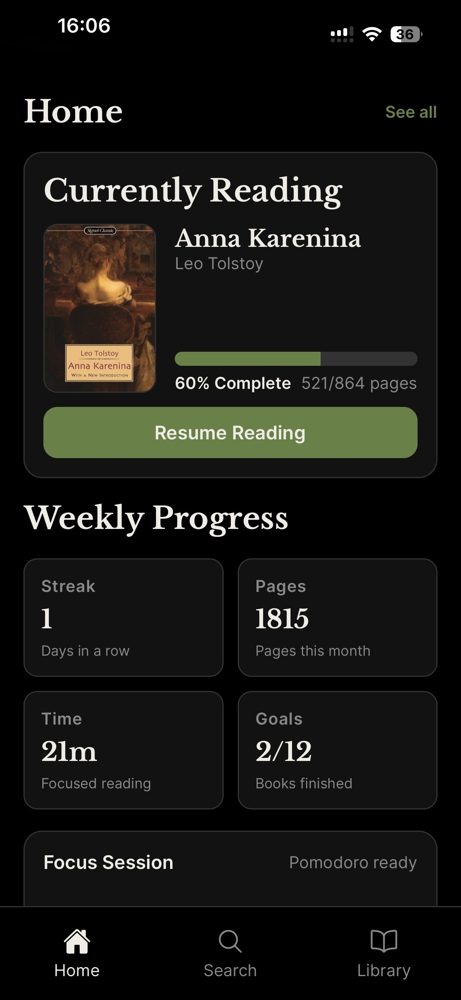
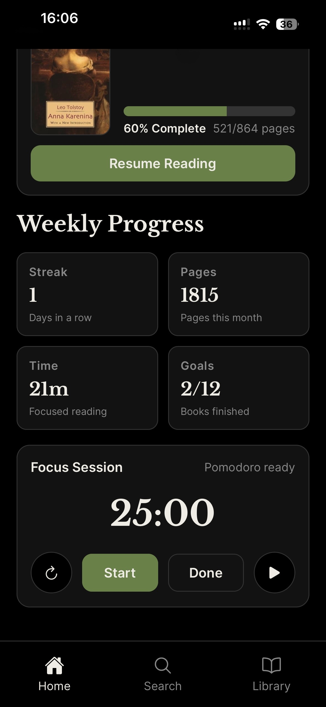
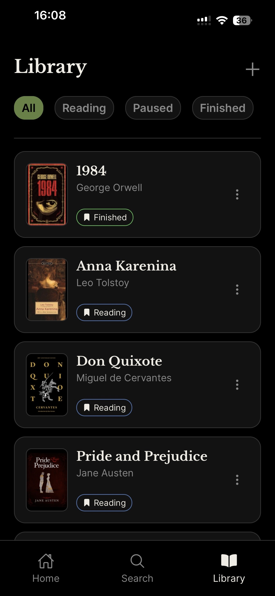
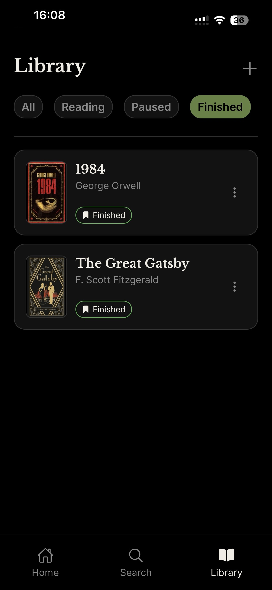
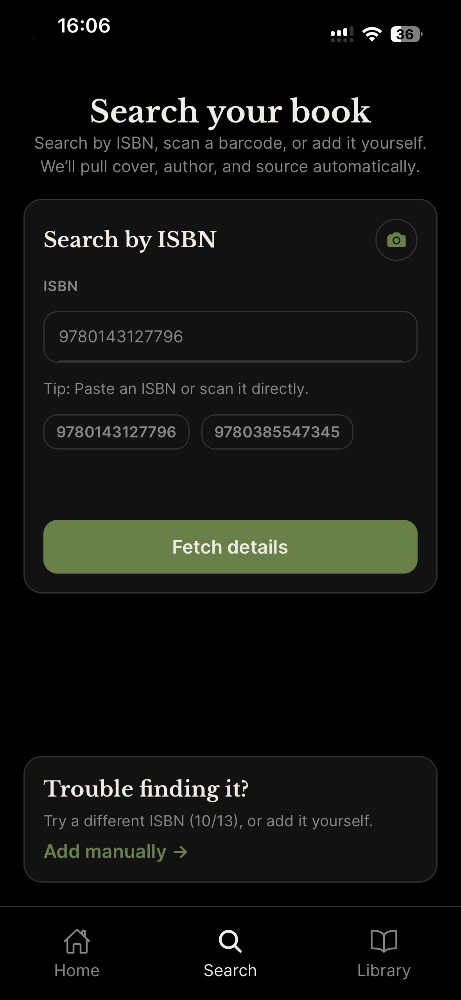
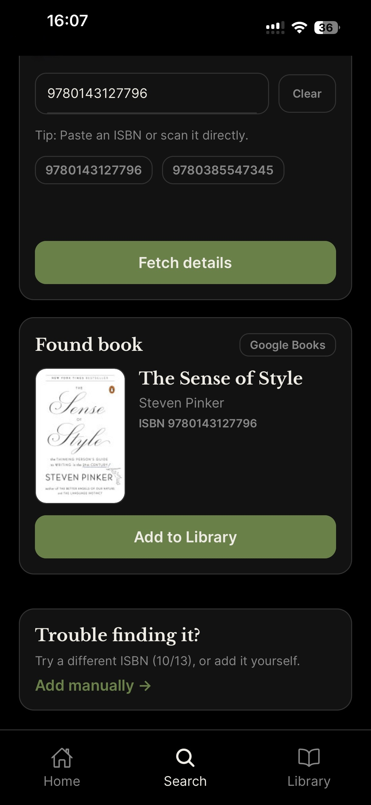
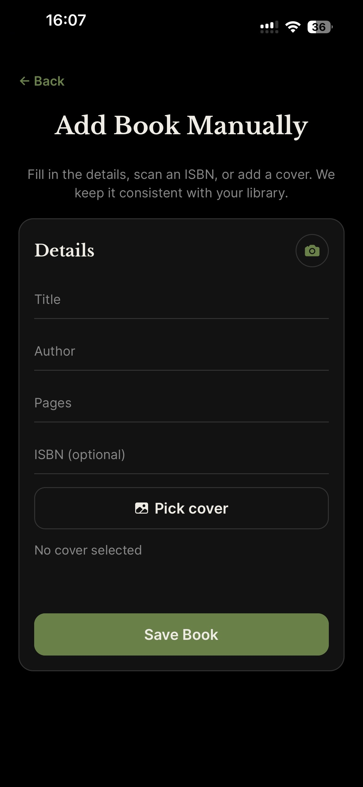
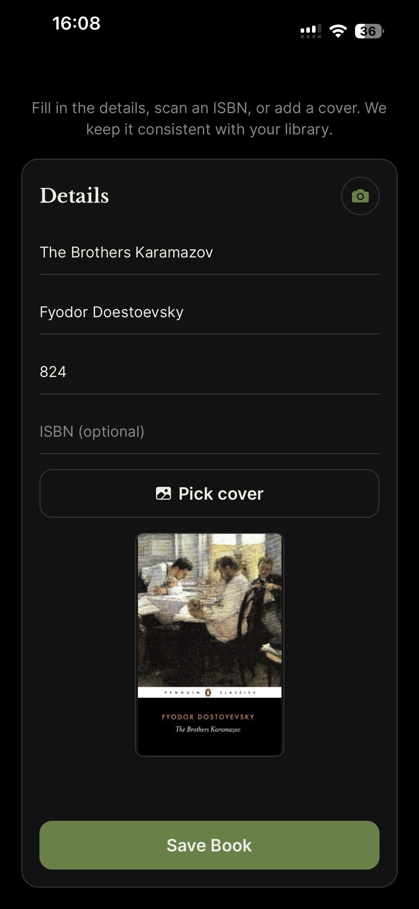

<div align="center">

# Whiskers

_A polished, offline-first reading companion built with Expo + React Native._

</div>

## Highlights at a Glance

- Barcode scanning + Open Library / Google Books lookups to prefill metadata in seconds.
- Manual add flow with cover picker, progress tracking, and per-book notes.
- Offline-first SQLite persistence via Drizzle ORM—no auth, no cloud, your data stays local.
- Mobile-first UX with Expo Router, lean components, and dark-friendly styling.

## Feature Walkthrough

- **Home dashboard:** Current reading list, pace, and weekly streak cues to keep momentum.  
  
  

- **Library management:** Card-first grid with status pills (Reading, Paused, Finished) and quick access to details.  
  
  
  

- **Search and scan:** ISBN scanning and text search that prefill metadata from Open Library / Google Books.  
  
  

- **Add a book (manual or enriched):** Clean form with cover picker, author/title/pages, and optional ISBN for downstream lookups.  
  
  

## Product Story

Whiskers is designed to keep long-form reading organized: capture a book via scan or search, drop quick notes with tags, and track progress without losing context. The app is intentionally offline-first to keep focus on reading—not accounts, sync, or ads.

## Core Features

- **Capture fast:** Scan an ISBN or search by title/author; metadata pre-fills the add form.
- **Flexible covers:** Import from gallery or use provided art; previews fit without cropping.
- **Progress tracking:** Update current page, see percent complete, and watch weekly streaks.
- **Notes that stick:** Per-book note streams with lightweight categorization for recall.
- **Library controls:** Filters by status (Reading, Paused, Finished) with clean cards.

## Architecture

- **Client:** Expo + React Native with Expo Router for file-based navigation.
- **State/logic:** Screen-specific hooks keep UI lean; minimal global state.
- **Data:** Drizzle ORM on Expo SQLite for local, schema-driven persistence.
- **Integrations:** Google Books / Open Library for metadata enrichment.

## Developer Experience

- TypeScript everywhere with strict eslint/tsconfig defaults.
- Modular feature folders (add-book, search, library, book, camera) to keep changes scoped.
- Theming via `src/constants/theme.ts` for consistent colors and typography.

## Getting Started

```bash
npm install
npx expo start
```

- Choose a platform in the Expo CLI (iOS simulator, Android emulator, or Expo Go).
- On first boot, allow the app to run migrations; if the DB feels stale, reload once.

## Project Map

- App shell and routing: `src/app`
- Feature views and logic: `src/features/*`
- Data + services: `src/modules/*`
- Database schema/migrations: `drizzle/`
- Assets and README screenshots: `assets/README/`

## Tech Stack

- **Expo / React Native** for mobile UI
- **Expo Router** for navigation
- **Drizzle ORM + Expo SQLite** for offline data
- **TypeScript** for safety and IDE support

## Contributing

Issues and PRs are welcome. Focus on keeping the experience fast, offline-first, and distraction-free.
